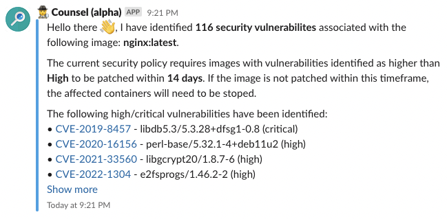

# 🕵️‍♀️ Counsel - A tool for monitoring and notifying the vulnerabilities of docker containers.

> ⚠️ Counsel is alpha software and currently in development (i.e., no tests, no documentation).

Counsel is a simple application that scans running [Docker](https://www.docker.com/) containers. Counsel can send [Slack](https://slack.com/intl/en-gb) notifications when specific vulnerbility levels are identified and send reminder if the countainer remains unpatched.



## ℹ️ Installation and Usage
Counsel can be installed using pip:
```
pip install counsel
```

### 📒 Requirements
Counsel requires a running [Docker](https://www.docker.com/) installation in order to identify the currently running containers.

Counsel uses the following two tools for scanning the vulnerabilities of the running countainers:
- [Syft](https://github.com/anchore/syft): A CLI tool and Go library for generating a Software Bill of Materials (SBOM) from container images.
- [Grype](https://github.com/anchore/grype): A vulnerability scanner for container images.


### 🐳 Docker
You can run a Counsel using docker as long as the host docker socket is exposed to Counsel.
The easiest way to install docker is to pull the image from DockerHub and run it using the following command (you will need to use your own [slack webhook url](https://api.slack.com/messaging/webhooks)):
```
docker run -v /var/run/docker.sock:/var/run/docker.sock -e COUNSEL_SLACK_URL="<SLACK_WEBHOOK_URL>" evhart/counsel
```

You can also build the image dierctly using the following command:
```
docker build -t evhart/counsel .   
```

### 🖥️ Command Line Interface (CLI)
Counsel has a simple CLI interface that be accessed using the ```counsel``` command. Counsel support migrating/exporting data from one database ot another database and showing the firs rows from databases.

```
 Usage: python -m counsel.cli [OPTIONS]                                         
                                                                                
 🕵️‍♀️ Counsel - A tool for monitoring the vulnerabilities of docker containers.   
                                                                                
╭─ Options ────────────────────────────────────────────────────────────────────╮
│ --scan-schedule             TEXT                     Schedule when to run    │
│                                                      Counsel.                │
│                                                      [env var:               │
│                                                      COUNSEL_SCAN_SHEDULE]   │
│ --initial-scan                                       Run an initial scan     │
│                                                      before starting the     │
│                                                      scheduler.              │
│                                                      [env var:               │
│                                                      COUNSEL_INITIAL_SCAN]   │
│ --alert-threshold           [unknown|negligible|low  Minimum vulnerability   │
│                             |medium|high|critical]   threshold for raising   │
│                                                      an alert.               │
│                                                      [env var:               │
│                                                      COUNSEL_THRESHOLD]      │
│                                                      [default: high]         │
│ --remind-delay              INTEGER                  When a                  │
│                                                      notification/action     │
│                                                      reminder should be sent │
│                                                      (in days).              │
│                                                      [env var:               │
│                                                      COUNSEL_REMIND_DELAY]   │
│                                                      [default: 10]           │
│ --kill-delay                INTEGER                  When the final          │
│                                                      notification/action     │
│                                                      should be sent (in      │
│                                                      days).                  │
│                                                      [env var:               │
│                                                      COUNSEL_KILL_DELAY]     │
│                                                      [default: 14]           │
│ --slack-webhook-url         TEXT                     Slack webhook URL for   │
│                                                      alert notifications.    │
│                                                      [env var:               │
│                                                      COUNSEL_SLACK_URL]      │
│ --slack-msg-template        TEXT                     Slack Jinja2 template   │
│                                                      for alert               │
│                                                      notifications.          │
│                                                      [env var:               │
│                                                      COUNSEL_SLACK_MSG_TEMP… │
│ --install-completion                                 Install completion for  │
│                                                      the current shell.      │
│ --show-completion                                    Show completion for the │
│                                                      current shell, to copy  │
│                                                      it or customize the     │
│                                                      installation.           │
│ --help                                               Show this message and   │
│                                                      exit.                   │
╰──────────────────────────────────────────────────────────────────────────────╯
```
